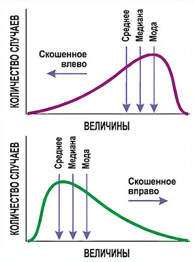

# 18-EDA

- Исследовательский анализ данных (EDA) на детальном датасете Airbnb по городу Copenhagen, Hovedstaden, Denmark за 30 June, 2026.

## Дата: 2026-08-20 (20 - 22)

## Задача

Провести полноценный EDA-проект на открытом датасете Inside Airbnb:
- Загрузка и инспекция структуры данных
- Очистка грязных данных (парсинг цен, приведение булевых типов, обработка текста)
- Анализ и логическая импутация пропусков
- Анализ распределений целевой переменной (гистограмма + Boxplot)
- Корреляционный анализ мультиколлинеарности и драйверов цены
- Формулирование и визуализация 5 бизнес-инсайтов
- Оформление отчета в README.md и вынос пайплайна в `main.py`

Часть блока B («NumPy, Pandas, EDA», задача 18) roadmap justxor.

## Подход

1. Структура проекта по стандарту Cookiecutter Data Science (`data/raw/`, `notebooks/`, `figures/`)
2. Изоляция и управление зависимостями через `uv` (`pyproject.toml` + `uv.lock`)
3. Разделение исследования (`.ipynb`) и воспроизводимого продакшн-пайплайна (`main.py`)
4. Векторизованные операции в Pandas вместо медленных циклов
5. Статистическая визуализация на Matplotlib OO-API, Seaborn и интерактивный гео-слой на Plotly

## Что сделал:

- Загрузил и исследовал подробный архив `listings.csv.gz` (23k+ строк, 90 колонок)
- Отобрал 20 ключевых признаков и очистил `price` от символов валюты (`$`, `,`)
- Обосновал и выполнил импутацию пропусков (`reviews_per_month = 0`, медианы комнат/кроватей)
- Построил распределение цен с отсечением 99-го перцентиля аномальных выбросов
- Рассчитал матрицу корреляций Спирмена и выявил мультиколлинеарность (`accommodates`, `bedrooms`, `beds`)
- Визуализировал 5 бизнес-инсайтов (типы жилья, география цен, статус Superhost, вместимость, геокарта)
- Автоматизировал генерацию всех графиков и отчета в скрипте `main.py`
- Оформил профессиональный `README.md` с вставкой артефактов

### Что узнал нового/споткнулся
1. Индустриальный открытый стандарт Cookiecutter Data Science (https://cookiecutter-data-science.drivendata.org/), созданный компанией DrivenData, которым пользуются в Kaggle Grandmasters, Uber, Meta и исследовательских лабораториях.

2. Указывать относительные пути лучше, чем абсолютные
```plaintext
# ВАРИАНТ 1: Относительный путь от папки notebooks (рекомендуется)
DATA_PATH = Path("../data/raw/listings.csv.gz")

# ВАРИАНТ 2: Абсолютный путь с прямыми слэшами или raw-строкой (r"...")
DATA_PATH = Path(r"C:\Users\Neradio\Downloads\python-foundations\18-EDA-airbnb\data\raw\listings.csv.gz")
```

Две точки `..` обозначают родительскую папку — то есть папку на один уровень выше текущей.
Пример: путь `../data/raw/listings.csv.gz` означает «поднимись на уровень выше (в родительскую папку) и оттуда укажи на папку `data`.

3. dpi = 300 это стандарт, при котором изображение не размыто и весит компактно
```Python
fig.savefig("../figures/insights_3_4.png", dpi=300, bbox_inches="tight")
```

4. Есть смысл связанные гипотезы загонять в один логический блок `plt.subplots(1, 2)`.
Например, два категориальных среза: «по типу жилья» и «по району».

5. Файлы до 10–50 МБ можно коммитить в Git. Лимит одного файла на GitHub составляет 100 МБ.

6. `main.py` нужен для того, чтобы перегенерировать отчёт на новых данных, не прокликивая 20 ячеек блокнота. Пайплайн запускается одной командой.
А также он разбит как и требовалось в задании, т.е. сначала
    1. загрузка
    2. очистка
    3. пропуски
    4. распределения
    5. корреляции
    6. интересных инсайтов в виде графиков
    7. README с выводами.

---

7. Прежде чем кидать файлы ИИ для проверки/рефакторинга, *не забывай сохранять* `(Ctrl + S)`.

8. `pd.read_csv()` умеет читать сжатые архивы `.csv.gz` напрямую «на лету» без предварительной ручной распаковки на диск.

9. В `VS Code` по умолчанию рабочая папка блокнота — это корень проекта, а не подпапка. Учитывай при указании относительных путей `../.`

10. Для избежаний ошибок с путями `SyntaxError: unicodeescape` можно использовать кроссплатформенный `pathlib.Path` с прямыми слэшами `/`.

11. На скошенных распределениях с тяжелым правым хвостом (цены, зарплаты) среднее завышается выбросами, поэтому «типичное значение» всегда оценивается *медианой*.


12. k-ый перцентиль — это значение, ниже которого лежит k% всей выборки объектов, а не процент от максимального числа.