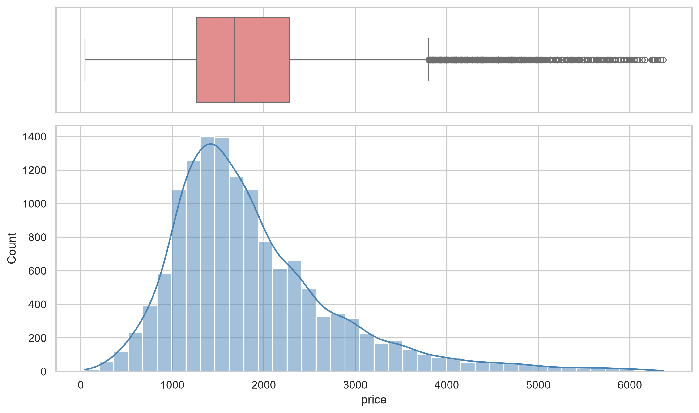
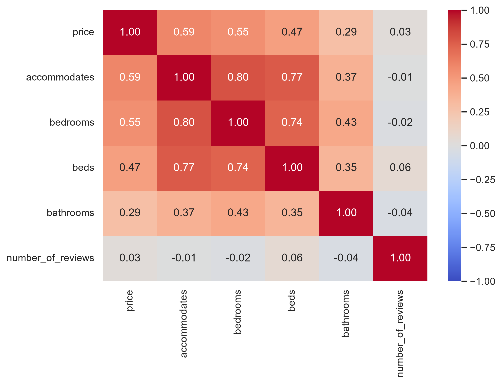
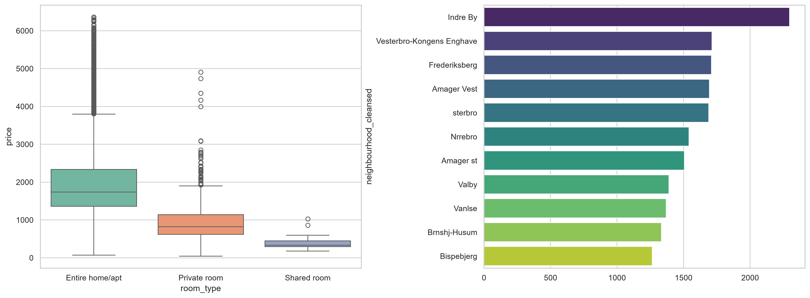
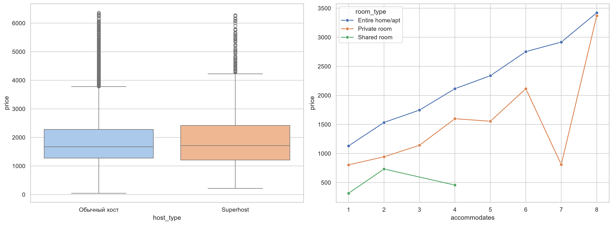

# 📊 Airbnb Copenhagen EDA

Разведочный анализ данных (Exploratory Data Analysis) рынка краткосрочной аренды жилья в Копенгагене на основе детального датасета Inside Airbnb (~13.8k очищенных объявлений).

Учебный проект из **блока B (задача 18)** roadmap [justxor](https://github.com/justxor/MachineLearningRoadmap#-%D0%B1%D0%BB%D0%BE%D0%BA-b-numpy-pandas-eda-%D0%B7%D0%B0%D0%B4%D0%B0%D1%87%D0%B8-1120) — «NumPy, Pandas, EDA».

## 🛠 Технологический стек

- **Python 3.12+**
- **[uv](https://github.com/astral-sh/uv)** — современный менеджер окружения и зависимостей
- **[Pandas](https://pandas.pydata.org/)** & **[NumPy](https://numpy.org/)** — векторизованная очистка, трансформация и агрегация данных
- **[Seaborn](https://seaborn.pydata.org/)** & **[Matplotlib](https://matplotlib.org/)** — статистический анализ распределений, boxplot'ы и корреляционные матрицы (OO-API)
- **[Plotly](https://plotly.com/python/)** — интерактивная геопространственная визуализация на карте (Mapbox)

## 🔍 Ключевые этапы пайплайна

- **Парсинг и типизация:** извлечение вещественных цен из строкового формата (`$1,250.00` → `float64`), парсинг санузлов из текстовых описаний, кастинг булевых флагов.
- **Очистка пропусков:** удаление пустых таргетов (`price`), заполнение нулевой активности по отзывам (`reviews_per_month = 0`), логическая импутация спальных мест по медианам и вместимости.
- **Фильтрация аномалий:** отсечение 99-го перцентиля экстремальных выбросов для сохранения робастности статистик.
- **Корреляционный анализ:** расчет матрицы ранговой корреляции Спирмена для выявления драйверов ценообразования и мультиколлинеарности.

## 💡 5 Бизнес-инсайтов

1. **Формат жилья:** Сдача объекта целиком (`Entire home/apt`) обеспечивает медианный доход ~1750 DKK/ночь, что в 2.2 раза превышает аренду отдельной комнаты (`Private room`, ~800 DKK).
2. **Локационная премия:** Исторический центр (`Indre By`) лидирует по стоимости (медиана >2300 DKK), в то время как периферийные районы (`Bispebjerg`, `Brønshøj-Husum`) доступнее почти вдвое (~1250–1300 DKK).
3. **Статус Superhost:** Наличие статуса супер-хозяина не дает статистически значимой ценовой премии по медиане, выступая фактором конверсии и доверия, а не инструментом завышения прайса.
4. **Масштабирование вместимости:** Параметр `accommodates` показывает сильнейшую корреляцию с ценой (0.59), причем наибольший прирост выручки от добавления спальных мест наблюдается у отдельных апартаментов.
5. **Мультиколлинеарность:** Признаки `accommodates`, `bedrooms` и `beds` скоррелированы между собой на уровне 0.74–0.80, что требует отбора признаков перед подачей в линейные модели ML.

## 📈 Визуализации

*Распределение цен и матрица корреляций:*



*Инсайты по типам жилья, районам и вместимости:*



*Интерактивная карта:*
[Интерактивная карта цен (Plotly)](figures/copenhagen_map.html) (скачайте и откройте в браузере).

## 🚀 Установка и запуск

```bash
cd 18-EDA-airbnb

# 1. Установка всех зависимостей через uv
uv sync

# 2. Запуск полного пайплайна (очистка данных и генерация графиков в figures/)
uv run python main.py

# 3. Интерактивная работа с блокнотом
uv run jupyter lab
```

## 📁 Структура проекта
```text
18-EDA-airbnb/
├── data/
│   └── raw/
│       └── listings.csv.gz     # Исходный датасет Inside Airbnb Copenhagen (в .gitignore)
├── figures/
│   ├── price_distribution.png  # График распределения цен
│   ├── correlation_matrix.png  # Матрица Спирмена
│   ├── insights_1_2.png        # Графики: Типы жилья и Районы
│   ├── insights_3_4.png        # Графики: Superhost и Вместимость
│   └── copenhagen_map.html     # Интерактивная карта Plotly
├── notebooks/
│   └── 18_copenhagen_eda.ipynb # Полный Jupyter Notebook с EDA
├── .python-version
├── pyproject.toml              # Описание проекта и зависимости
├── uv.lock                     # Фиксация точных версий всех зависимостей uv
├── README.md                   # Отчет по исследованию
├── 18-Notes.md                 # Учебный конспект (спотыкания и выводы)
└── main.py                     # Автономный скрипт генерации пайплайна и графиков
```